 <h1 align="center" >Welcome to Wonder Scapes  </h1>
 

  

 

## 🗝️ Keys

`OpenGL`, `3D Modeling`, `Virtual tour`, `glfw`, `glad`, `shaders`, `C++`, `glm`, `json`

## 🏷 Tags

## 🧠 Abstract

Project realized in C++ using OpenGl, it is based on a virtual walk in the 7 wonders of the modern world in real time and with cartoonish graphics using a simple but functional graphics engine.

## 📖 Introduction

Wonder Scape arises as an academic project of the subject “Graphic Programming” that combines the C++ language with the OpenGl standard specification. The objective is to make a virtual walk through the 7 wonders of the modern world using a simple graphics engine.

## 👻 Preview

 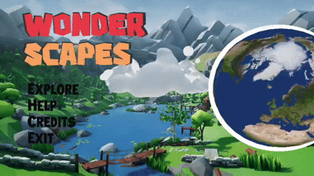

## 🧩 Requirements

### 💻 How to compile and run

#### 🔵 Windows

1- Install [Visual Studio](https://visualstudio.microsoft.com/) with C++ support. 
2- Open visual studio and click on “Clone a repository”. 
3- In the Github repository click on “code” and copy the url provided by the page. 
4- Then paste the url in the “Repository location” field and click on “Clone”. 
5- Now the dependencies will be configured, for that see the images provided below 

  
 <h3>Right click where the red circle points</h3>

 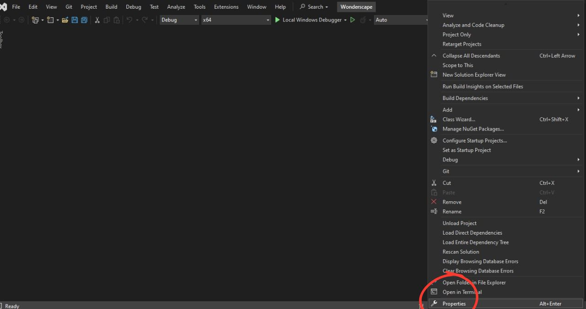 
 <h3>click on properties and you will see a pop-up window open.</h3>

 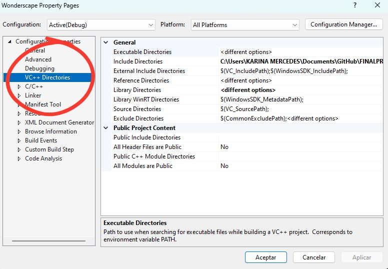 
 <h3>Verify that the setting is “Active(Debug)” and platforms is “All platforms”, if so, then click on “VC++ Directories”.</h3>

 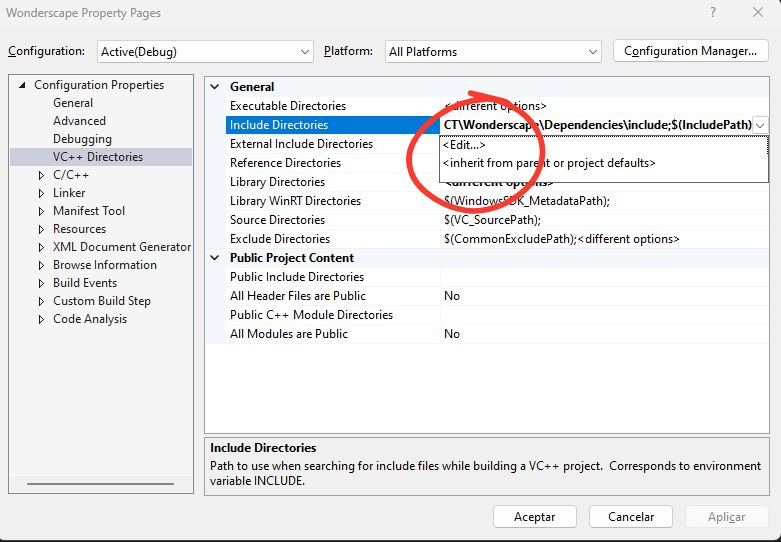 
 <h3>Go to the “Include Directories” section and click on “Edit”.</h3>

 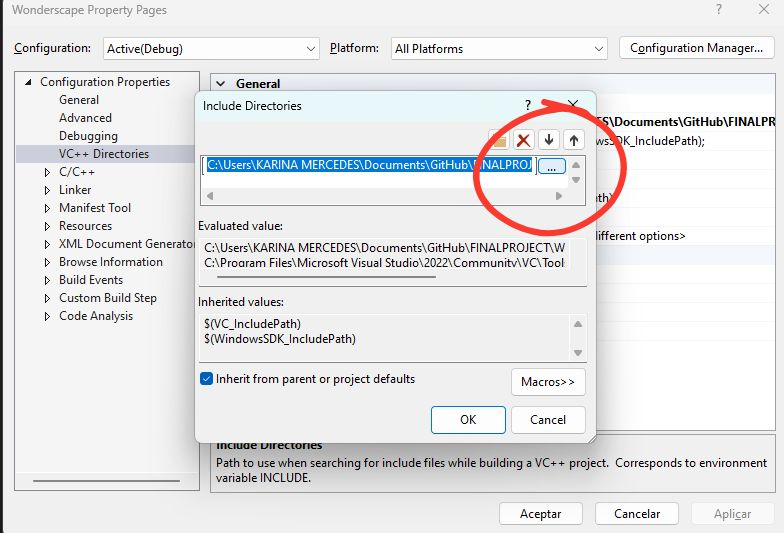 
 <h3>Click on the 3 points</h3>

 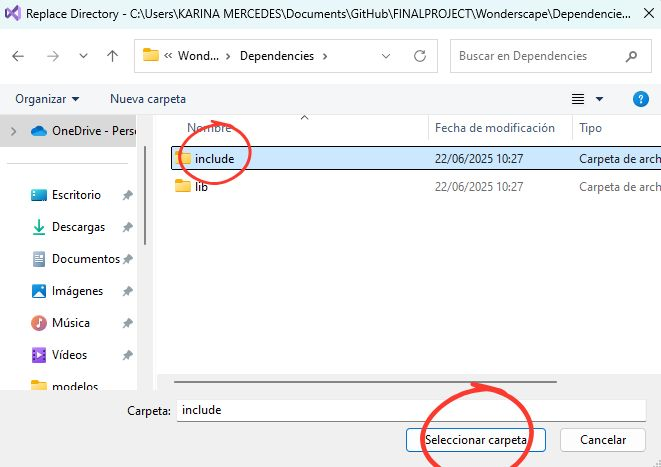 
 <h3>Verify that the “Include” folder is selected, then click on select folder. 
Note: This is done to have the address of your computer.</h3>
 <h4 color= "red"> **Note:🔴 Go to the end of the applied address and add the following: “;$(IncludePath)” this is needed to compile the program**</h4>

 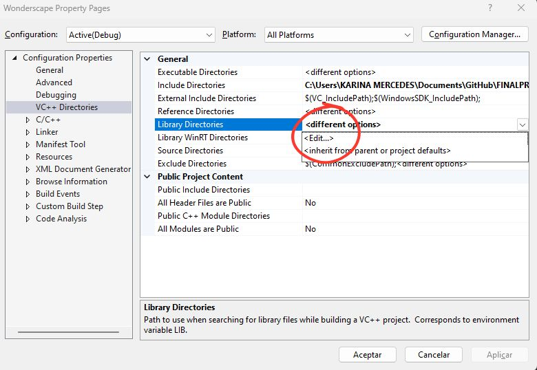 
 <h3>Now go to the “Library Directories” section and click on “Edit”.</h3>

 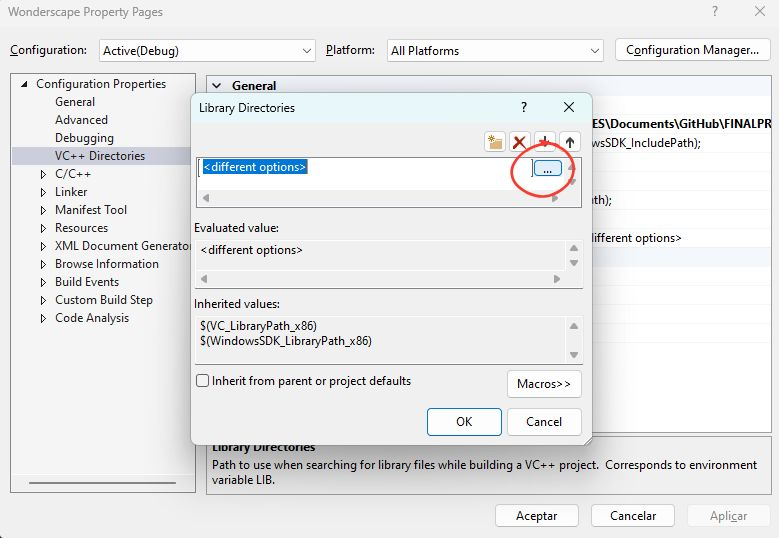 
 <h3>Click on the 3 points</h3>

 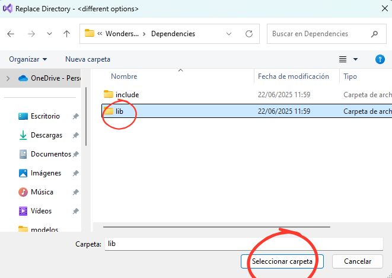 
 <h3>Verify that the “Lib” folder is selected, then click on “Select folder”.</h3>
 <h4 color= "red"> **Note:🔴 Go to the end of the applied address and add the following: “;$(LibraryPath)” this is needed to compile the program**</h4>

 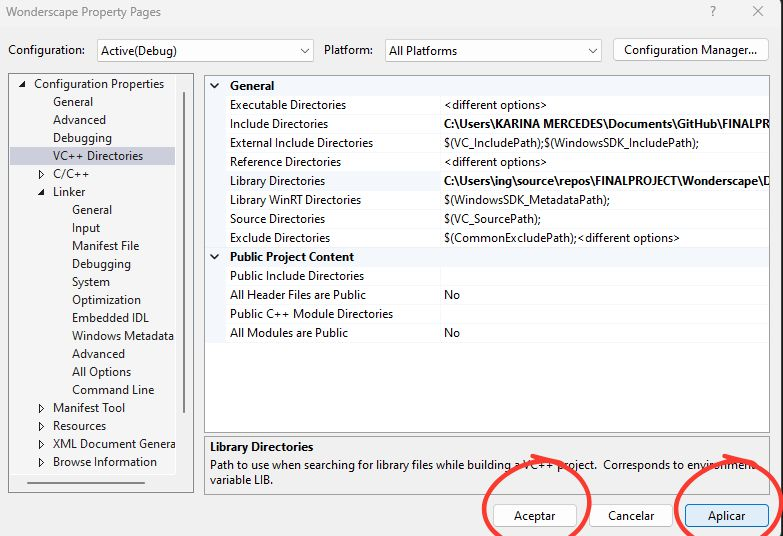 
 <h3>Verify that the addresses in the “Include Directories” and “Library Directories” fields match the names on your local disk, if so, click ‘Apply’ and “OK”.</h3>

 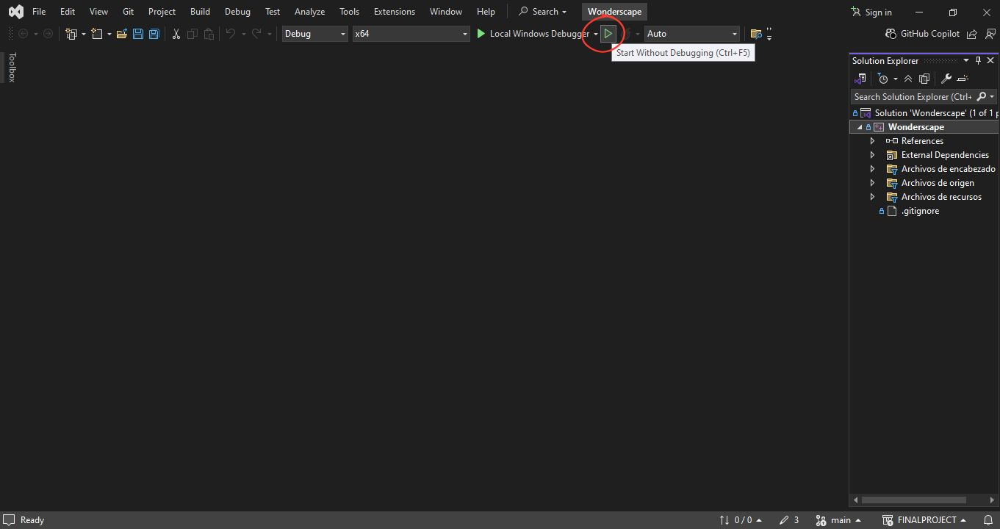 
 <h3>Finally, click on the green button and enjoy the program.</h3>

 
 
 <h1 align="center" > 😸Developers </h1>
 

|  |  |  | |
|-------------------------|-------------------------|-------------------------|-------------------------|
| **Hernández Julio**      | **Guerrero Ulises**            | **Baltodano Carles**        | **Rodríguez Axel** 
| “Interface and navigation system” | “Modeling and integration of wonders” | “Camera and environment programing” | “General desing and graphics optimization” | 

## 📄 License
 
This project is licensed under the terms of the [Do What The F*ck You Want To Public License (WTFPL)](LICENSE).

