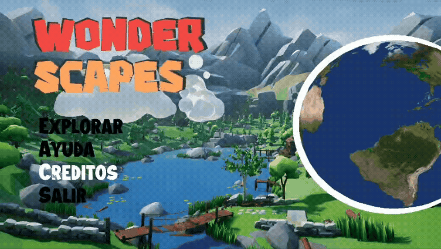

 <h1 align="center" >Welcome to Wonder Scape  </h1>
 

  

 

## 🏷 Tags

## 🧠 Abstract

Project realized in C++ using OpenGl, it is based on a virtual walk in the 7 wonders of the modern world in real time and with cartoonish graphics using a simple but functional graphics engine.

## 📖 Introduction

Wonder Scape arises as an academic project of the subject “Graphic Programming” that combines the C++ language with the OpenGl standard specification. The objective is to make a virtual walk through the 7 wonders of the modern world using a simple graphics engine.

## 👻 Preview

 

## 🧩 Requirements

### 💻 How to compile and run

#### 🔵 Windows

1- Install [Visual Studio](https://visualstudio.microsoft.com/) with C++ support.
2- Open visual studio and click on “Clone a repository”.
3- In the Github repository click on “code” and copy the url provided by the page.
4- Then paste the url in the “Repository location” field and click on “Clone”.
5- Now the dependencies will be configured, for that see the images provided below

